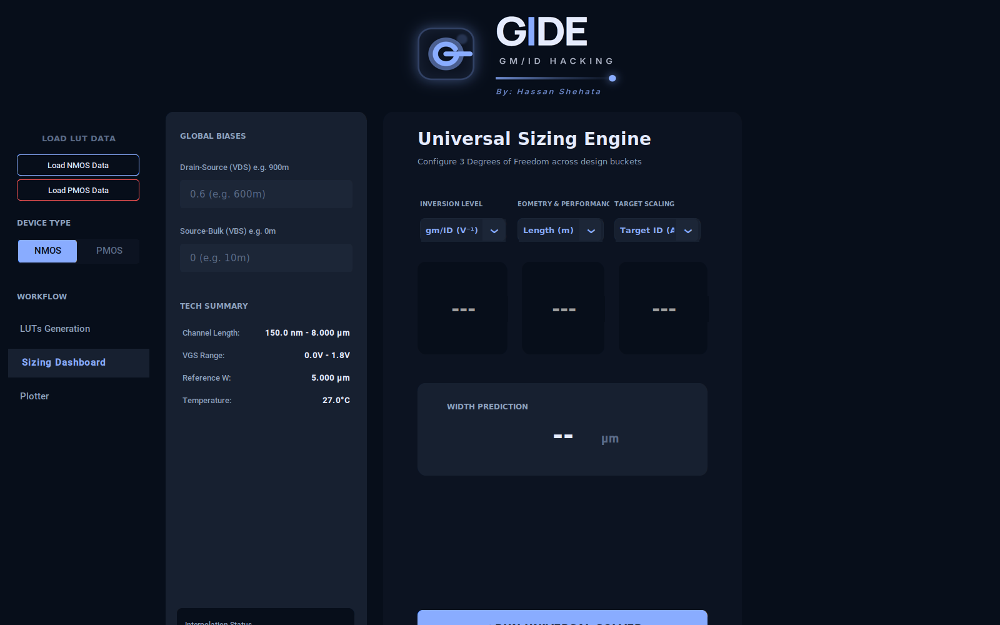
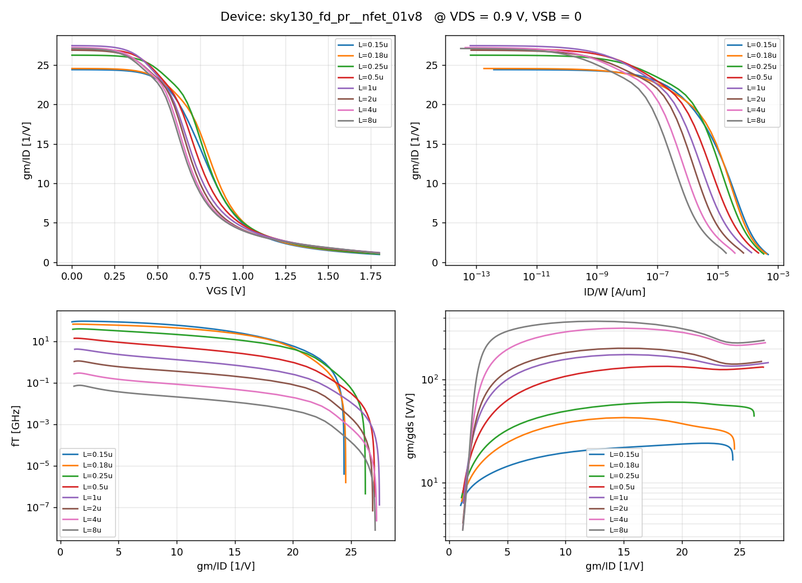

# gmid-sky130

**gm/ID look-up tables for the Skywater 130 nm PDK, generated with ngspice, in
the format [GIDE](https://github.com/hasanshahata/GIDE-Universal-Design-Studio)
loads.**

GIDE is a very nice gm/ID sizing tool — a Universal Sizing Engine that turns
design targets ($f_T$, intrinsic gain, target $g_m$) into a $W$ and $L$, plus a
plotter for the usual trade-off charts. But its built-in LUT generator drives
**Cadence Spectre**, which rules it out for anyone working in the open-source
sky130 flow.

This repo replaces that one step. It drives **ngspice** against the sky130A
models and writes `.pkl` files with exactly the schema GIDE's
`core/data_loader.py` expects, so you use **Load NMOS / PMOS Data** in the app
and simply ignore the LUTs Generation tab. Everything downstream of LUT
generation in GIDE — Sizing Dashboard, solver, plotter — is simulator-agnostic
and works unchanged.

```
    ngspice + sky130A                                  GIDE
┌──────────────────────────────┐                ┌─────────────────────┐
│ techsweep_ngspice.py         │    *.pkl       │ Load NMOS/PMOS Data │
│   nested L/VSB/VDS/VGS sweep │ ─────────────► │ Universal Solver    │
│   → GIDE-format pickle       │                │ Plotter             │
└──────────────────────────────┘                └─────────────────────┘
```



## Quick start

```sh
git clone https://github.com/Kskjordal/gmid-sky130.git
cd gmid-sky130

bash preflight.sh        # do you already have ngspice + sky130A?
python3 techsweep_ngspice.py --config sky130_config.json --outdir luts
python3 check_lut.py luts/*.pkl --vds 0.9
```

Five devices, ~300 k operating points each, in a couple of minutes. Then load
the `.pkl` files in GIDE.

### Requirements

Only three things: **ngspice**, **numpy**, and the **sky130A ngspice models**.
No xschem, magic, klayout or Docker.

`preflight.sh` is read-only and needs no sudo — it looks for ngspice, a python3
with numpy, and `sky130.lib.spice` (in `$PDK_ROOT`, `/opt/pdk/share/pdk`,
`~/.ciel`, `~/.volare`, then a bounded search under `/opt`), runs one operating
point through ngspice, and prints the exact command to use.

If something's missing, `setup_wsl.sh` installs it from scratch: ngspice from
apt, a venv (avoiding PEP 668 friction), and a prebuilt open_pdks sky130A via
[ciel](https://github.com/fossi-foundation/ciel). Written for WSL/Ubuntu but
fine on any Debian-ish system.

## What you get

One LUT per device, `tt` corner, 27 °C, reference W = 5 µm, nf = 1.
VGS and VDS sweep 0 → 1.8 V in 25 mV steps (73 × 73); VSB 0 → 1.8 V in 300 mV
steps. That's GIDE's suggested "Golden Config" rescaled from a 1.2 V node to
sky130's 1.8 V devices.

| Device | L values (µm) | ID/W max | fT max | gm/gds | gm/ID max |
|---|---|---|---|---|---|
| `nfet_01v8` | 0.15 0.18 0.25 0.5 1 2 4 8 | 529 µA/µm | 111 GHz | 0.013 – 385 | 31.5 |
| `nfet_01v8_lvt` | 0.15 0.18 0.25 0.5 1 2 | 597 µA/µm | 117 GHz | 0.010 – 160 | 34.0 |
| `pfet_01v8` | 0.15 0.18 0.25 0.5 1 2 4 8 | 206 µA/µm | 40 GHz | 0.017 – 4955 | 34.4 |
| `pfet_01v8_lvt` | 0.35 0.5 1 1.5 4 8 | 180 µA/µm | 12 GHz | 0.009 – 739 | 31.7 |
| `pfet_01v8_hvt` | 0.15 0.18 0.25 0.5 1 2 4 8 | 152 µA/µm | 33 GHz | 0.022 – 5171 | 35.9 |

> **There is no `nfet_01v8_hvt` in sky130.** The high-Vt flavour exists only for
> the PMOS. NMOS gives you the standard device and `_lvt`.

`check_lut.py` verifies each LUT before you trust it — monotonicity of $I_D$ in
$V_{GS}$ and $V_{DS}$, body effect on $|V_{th}|$, the subthreshold $g_m/I_D$
ceiling against the $kT/q$ limit, and NaN/Inf — then draws the four charts you
actually design from:



## The thing to know: sky130's model bins are point-like

sky130's BSIM4 models are binned, and each bin covers only about **±5 nm**
around its anchor length:

```
+ lmin = 1.45e-07 lmax = 1.55e-07 wmin = 4.995e-06 wmax = 5.005e-6
```

A device drawn at L = 0.30 µm therefore lands in no bin at all. ngspice does
not error — it quietly falls back to a neighbouring bin's fitted parameters and
applies BSIM's own geometry scaling. The output looks smooth and plausible and
is not what the PDK was characterised to say.

Two consequences shape this tool:

1. **Each device's `L_VEC` lists only lengths with a real bin at W = 5 µm** —
   the values in the table above. That is why the L axis is log-ish rather than
   the uniform 25 nm grid a Spectre-based flow would use. A uniform grid here
   would be mostly interpolated fiction. Widen it in `sky130_config.json` if you
   want more points for GIDE's PCHIP interpolation and accept the trade.

2. **Changing L requires re-parsing the netlist.** Bin selection happens at
   parse time, so `alter`-ing an instance's length gives you the old bin with
   new geometry. The generator instead instantiates *every* length as a
   parallel device (`xm0 … xmN`) on shared bias sources — which is also why one
   ngspice run covers a whole L sweep in seconds.

## How the sweep works

One ngspice process per device:

```spice
.lib <sky130.lib.spice> tt
.temp 27
vd d 0 dc 0
vg g 0 dc 0
vb b 0 dc 0
xm0 d g 0 b sky130_fd_pr__nfet_01v8 L=0.15 W=5 nf=1
xm1 d g 0 b sky130_fd_pr__nfet_01v8 L=0.18 W=5 nf=1
...
.control
  save @m.xm0.msky130_fd_pr__nfet_01v8[id] ...   ; every L, every signal
  alter vb dc = 0                                ; VSB loop
  dc vg 0 1.8 0.025 vd 0 1.8 0.025               ; VGS inner, VDS outer
  wrdata vsb000.dat <all vectors>
  ...
.endc
```

* Source grounded; the bulk source carries −VSB (NMOS) or +VSB (PMOS), and PMOS
  decks sweep gate and drain negative — mirroring what GIDE's Spectre netlist
  does.
* ngspice's `dc` takes two nested sources, so VGS × VDS is a single analysis.
  Only VSB needs an explicit loop.
* Data comes back through `wrdata` in ASCII with `set wr_singlescale`, so there
  is no raw-file parser to break across ngspice versions.
* sky130 decks run with `.option scale=1u`, so W and L are given in microns.
* Row order is VGS inner, VDS outer; the script reshapes to
  `(nL, nVGS, nVDS, nVSB)`.

## The pickle schema

`core/data_loader.py` reads a plain dict:

| Key | Shape | Meaning |
|---|---|---|
| `L`, `VGS`, `VDS`, `VSB` | 1-D | grid vectors, SI units |
| `W`, `NFING` | scalar | reference width (m), finger count |
| `ids`, `gm`, `gds`, `gmb` | `(nL, nVGS, nVDS, nVSB)` | DC + small signal |
| `vth`, `vdsat` | same | thresholds |
| `cgg`, `cgs`, `cgd`, `cdd`, `css` | same | required capacitances |
| `cgb`, `csg`, `cdg`, `csb`, `cdb` | same | optional; GIDE uses them if present |
| `INFO` | str | shown in GIDE's Tech Summary sidebar |

GIDE derives $g_m/I_D$, $I_D/W$, $g_m/g_{ds}$, $f_T = g_m/(2\pi C_{gg})$ and
$V_A = I_D/g_{ds}$ itself on load, so those aren't stored. It also applies a
light Gaussian smoothing (σ = 0.2) to `ID`, `GM` and `CGG` for solver
stability — the pickle holds raw simulated values.

Signs: ngspice already returns magnitudes for PMOS small-signal quantities;
capacitances are stored as magnitudes for both polarities, matching what GIDE
does internally for PMOS.

## Files

| File | What it is |
|---|---|
| `preflight.sh` | Read-only environment check. Start here. |
| `setup_wsl.sh` | Installs ngspice + sky130A from scratch, no Docker. |
| `techsweep_ngspice.py` | The generator. Needs only `numpy` + `ngspice`. |
| `sky130_config.json` | Sweep definition: PDK, corner, devices, bias grids. |
| `check_lut.py` | Physics checks + the four gm/ID charts. Needs `matplotlib`. |
| `run_gide.py` | Launches GIDE with a fix for a customtkinter mouse-wheel crash. |

Generated `.pkl` files are gitignored — they're ~170 MB and regenerate in a
couple of minutes.

## Running GIDE

```sh
git clone https://github.com/hasanshahata/GIDE-Universal-Design-Studio.git
cd GIDE-Universal-Design-Studio
python -m pip install customtkinter pillow numpy scipy matplotlib
python ../run_gide.py --gide-dir .
```

`pillow` is easy to miss (`from PIL import Image` in `gui/app.py`). `tkinter`
must be in the interpreter (`sudo apt-get install python3-tk` on Debian-ish
systems). `psf_utils` is **not** needed — it's imported only by the Spectre
generator you're bypassing.

`run_gide.py` exists because `CTkScrollableFrame` binds the mouse wheel with
`bind_all` and then walks `.master` on whatever Tk hands it — which is
sometimes a pathname *string* rather than a widget, giving
`AttributeError: 'str' object has no attribute 'master'` on every scroll.
Embedded matplotlib canvases are the usual source, and GIDE's Plotter is full
of them. It's non-fatal but noisy, it's a customtkinter bug rather than a GIDE
one, and downgrading doesn't help — 5.2.2 has the same flaw under the older
name `check_if_master_is_canvas`. The launcher patches the method at runtime to
resolve pathname strings with `nametowidget`; nothing is written to disk.

A correctly loaded sky130 LUT shows in the Sizing Dashboard's Tech Summary as
`Channel Length: 150.0 nm - 8.000 um`, `VGS Range: 0.0V - 1.8V`,
`Reference W: 5.000 um`. A 1.2 V or 65 nm reading means you've loaded one of
the sample LUTs bundled with the GIDE release instead.

## Caveats

* **These are intrinsic-device LUTs.** With sky130's default BSIM4 settings,
  `ad`/`as`/`pd`/`ps` change none of the stored quantities — the reported
  `cdd`/`cdb` are intrinsic charge-based capacitances and there is no S/D
  parasitic resistance. A real drawn device will be slower than these $f_T$
  figures suggest. A `geometry` block in the config lets you pass extra
  instance parameters if you enable a model option that uses them.
* **`tt` corner, 27 °C.** Change `pdk.CORNER` and `pdk.TEMP` for other
  conditions and give the outputs distinct names.
* **Point-like bins** — see above.

## Credits

* **[GIDE — Universal Design Studio](https://github.com/hasanshahata/GIDE-Universal-Design-Studio)**
  by Hassan Shehata Ali BadrEL-den (Mansoura University). This repo only
  replaces its LUT-generation step; the sizing engine, solver and plotter are
  entirely his work.
* **[aicex](https://github.com/wulffern/aicex)** and the
  [sky130 tutorial](https://analogicus.com/aic2026/sky130nm_tutorial) by
  Carsten Wulff (NTNU), which is where the sky130 + ngspice toolchain this
  targets comes from.
* **[Skywater SKY130 PDK](https://github.com/google/skywater-pdk)** (Apache
  2.0), via [open_pdks](https://github.com/RTimothyEdwards/open_pdks).

If an ngspice backend would be useful upstream, this is worth raising as an
issue or PR on the GIDE repo — the schema work is the reusable part.

## Licence

Apache 2.0 — see [LICENSE](LICENSE). This covers the scripts in this repo only;
the PDK models and GIDE carry their own licences.
